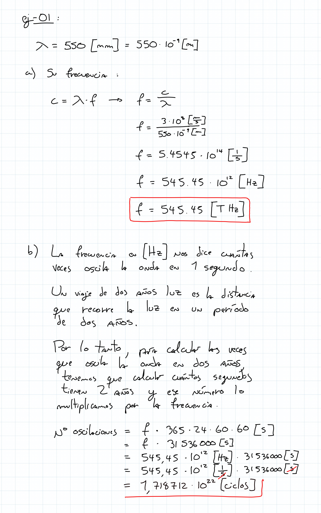
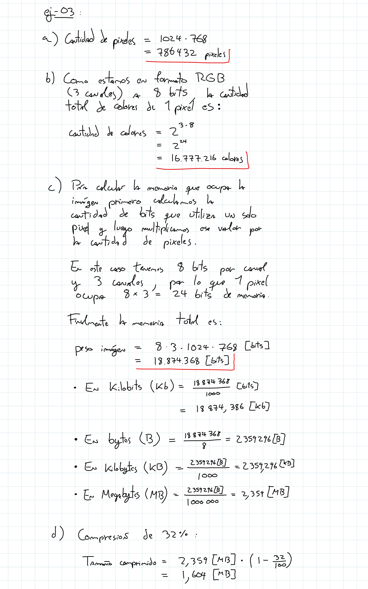

# ayudantia-12

viernes 30 de mayo 2025

## ejercicio-01: espectro de luz visible

si una luz de color tipo "verde" tiene una longitud de onda de $550[nm]$

a) ¿cuál es su frecuencia?

b) si esta luz viaja por el espacio una distancia de 2 años luz ¿cuántas veces oscila la onda en este trayecto?

## ejercicio-02: fibra óptica

una fibra óptica transmite información a través de una luz láser de longitud de onda $1200[nm]$, invisible al ojo humano.

El láser es usado para transmitir números utilizando los cíclos de oscilación de la onda del láser, separados con un ciclo de silencio (sin luz). Al terminar de transmitir un número completo, se envía un símbolo de finalización de dos ciclos de silencio.

Por ejemplo, si se quiere trasmitir el el número 23: se activa el láser por 2 ciclos, se silencia un ciclo, luego se activa el láser por 3 ciclos de onda, y se silencia dos ciclos.

a) ¿cuál es la frecuencia y período de la luz láser? asuma que se transmite a la velocidad de la luz.

b) grafique el comportamiento del láser para transmitir el número 12.

c) ¿cuánto tiempo demora el láser en transmitir el número 12?

d) grafique el comportamiento del láser para transmitir el número 311.

e) ¿cuánto tiempo demora el láser en transmitir el número 311?

## ejercicio-03

se tiene una imágen digital de 1024 x 768 pixeles en formato RGB de 8 bits por canal.

a) ¿cuántos píxeles tiene en total la imágen?

b) ¿cuántos colores posibles puede desplegar 1 pixel en esta imágen?

c) ¿Cuánta memoria ocupa la imágen? calcular en:

- bits (b)
- kilobits (Kb)
- bytes (B)
- kilobytes (KB)
- megabytes (MB)

d) Si la imagen se comprime en formato JPG y el tamaño original se logra reducir en un 32% ¿cuánta memoria en megabytes (MB) ocupa la imágen comprimida?

